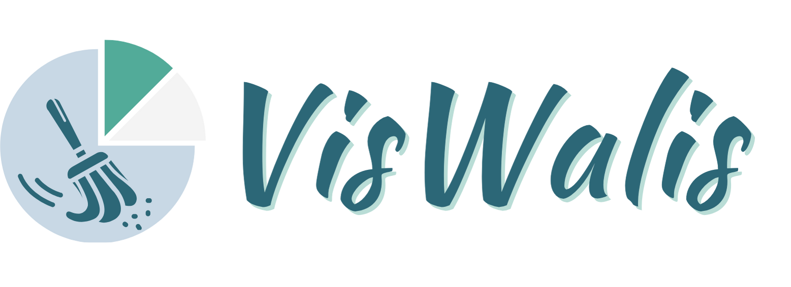

# VisWalis: A Simple Web Application for Data Analytics




## Overview

VisWalis is a responsive web application designed for streamlined data analysis. It provides features for data cleaning, visualization, report generation, and an AI-powered chatbot.

## Features

### 1. Data Cleaning

- Description: Provides tools to prepare and clean uploaded datasets.
- Functions:
  - Standardize column names (lowercase, uppercase, sentence case).
  - Drop unnecessary columns or duplicate rows.
  - Handle missing values using strategies like mean, median, mode, or manual input.
  - Remove outliers from numerical columns.

### 2. Dashboard

- Description: Offers interactive data visualizations.
- Features:
  - Generates insights from uploaded data using the Dashboard module.
  - Visualizations are dynamically rendered based on the data.

### 3. Report Generation

- Description: Creates detailed profiling reports of the dataset.
- Functions:
  - Uses ydata-profiling to generate explorative reports.
  - Allows users to download HTML reports.

### 4. AI Chatbot

- Description: AI-powered chatbot that answers based on the given prompt assisting the user to further understand the data analysis.
- Service: Uses GroqCloud API for natural language processing and AI interaction.

## Environment and Dependencies

The following libraries and tools are used in the VisWalis application:

- Python Libraries:
  - Streamlit: UI framework for building the app.
  - pandas: For data manipulation and analysis.
  - numpy: For numerical operations during data cleaning.
  - Plotly Express: For creating interactive data visualizations.
  - ydata-profiling: For detailed data profiling and report generation.
  - GroqCloud: Provides AI chatbot capabilities via free API services.

## System Requirements

- Python Version: 3.8+
- Additional libraries (check the GitHub Repository for the other requirements.)

## Endpoints

Unlike traditional applications, VisWalis utilizes Streamlit framework to handle both the front and the backend of the application. It does not use traditional RESTful endpoints but uses the following internal flows:

### File Upload

Input: CSV file (via st.file_uploader).
Process: Parses the file into a pandas DataFrame.
Data Cleaning Actions:
Functions:
- standardize_columns(): by stripping leading/trailing spaces converting to lowercase, and replacing spaces with underscores.
- handle_missing_values(strategy): Applies the chosen missing-value strategy.
- drop_duplicates(): Removes duplicate rows.
- drop_column(column_name): Removes specified columns
- remove_outliers(columns): Removes outliers from specified columns.
- standardize_dates(column, date_format): Standardized dates in a specified column to a uniform format
- clean_symbol(column, sybols): Remove unnecessary symbols from values in a specified column.
- convert_to_numeric(column): Convert string representations of a number to numeric values.
- normalize_case(column, case_type): Normalize the case of text data in a specified column.
- replace_values(column, to_replace, replacement): Replace specific values in a column.

Response: Updated pandas DataFrame rendered in the UI.

### Report Generation

Input: Dataset and report title.
Process: Generates an HTML profiling report.
Output: Downloadable HTML report.

### AI Chatbot

Service: Integrates GroqCloud API.
Input: User questions via chat.
Output: AI-powered responses.

## Setup and Execution
1. Clone the repository

```
git clone https://github.com/b0kja85/da-jakey-chain
```

2. Change the directory to `./app`.

```
cd app
```

3. Install all the required dependencies.

```
pip install -r "requirements.txt"
```

4. Run Streamlit Server

```
streamlit run app.py
```

--- 
JKMK